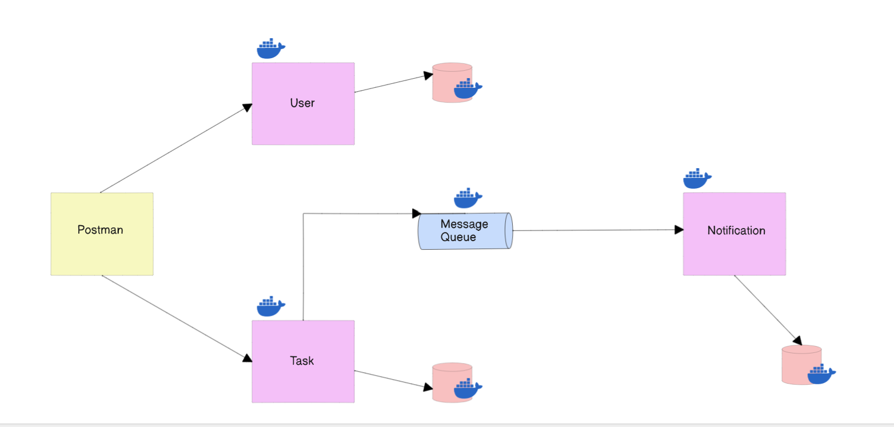

# Task Management Microservices

## 📌 Overview
This project is a **microservices-based Task Management System** built using **Node.js**, **MongoDB**, and **RabbitMQ**, all containerized with **Docker**.  

It demonstrates:
- **Service Isolation** – Each service runs independently
- **Asynchronous Communication** – Implemented via RabbitMQ
- **Persistent Storage** – MongoDB for data storage
- **Containerized Deployment** – Using Docker Compose for orchestration

### 🧩 Services:
- **User Service** – Handles user management
- **Task Service** – Manages tasks and publishes events
- **Notification Service** – Listens for task creation events and processes notifications

---

## 🏗 Architecture
The system follows an **event-driven microservices design**.  

  

---

## ✅ Prerequisites
Before running the project, make sure you have:
- [**Docker Desktop**](https://www.docker.com/products/docker-desktop) installed and running
- **Git** installed
- Basic knowledge of Docker and Node.js

---

## ▶ How to Run Locally

### **1. Clone the Repository**
```bash
git clone https://github.com/your-username/task-management-microservices.git
cd task-management-microservices
```

### **2. Start Services using Docker Compose**
Make sure **Docker Desktop is running**, then execute:
```bash
docker-compose up --build
```

### **3. Access Services**
- **User Service:** `http://localhost:3000`
- **Task Service:** `http://localhost:3001`
- **Notification Service:** `http://localhost:3002`
- **RabbitMQ Management UI:** `http://localhost:15672`  
  **Default Credentials:**  
  - Username: `guest`  
  - Password: `guest`  

---

✅ That’s it! Your **Task Management Microservices** system is now running on Docker.

---

## 🚀 Features
✔ Microservices Architecture  
✔ Event-Driven Communication with RabbitMQ  
✔ RESTful APIs for Users and Tasks  
✔ Containerized Deployment with Docker  
✔ Scalable and Maintainable Design  

---
